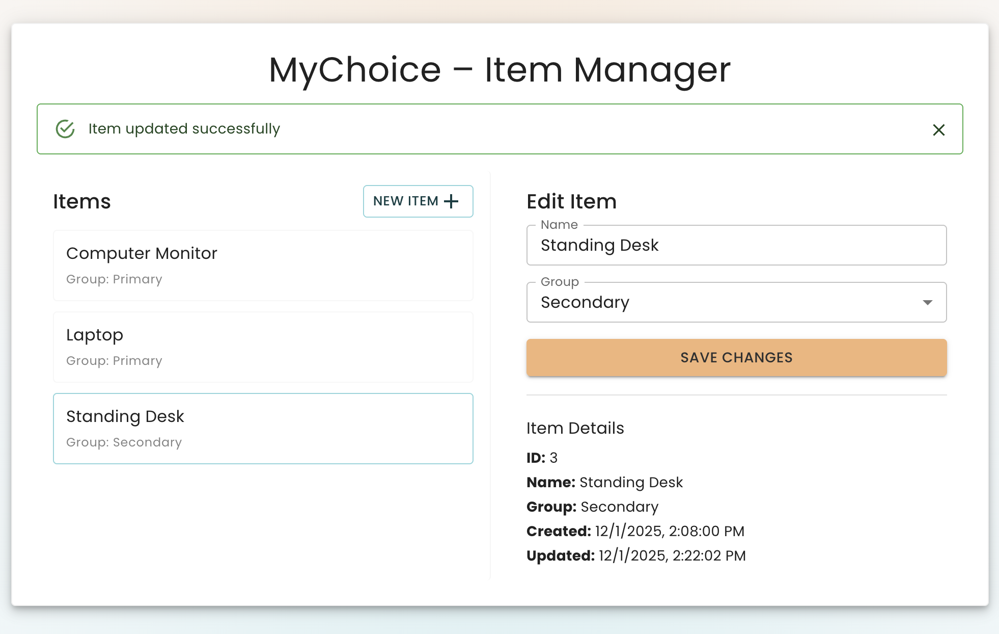

# MyChoice – Full Stack Application Setup Guide



Backend: Django REST API + PostgreSQL DB
Frontend: React | TypeScript | Material UI

Backend is located in `/backend`, frontend in `/frontend`.

## 1. Clone the Repository

```bash
git clone https://github.com/danielvallecl/mychoice.git
cd mychoice
```

## 2. Install Dependencies

### macOS

```bash
brew install python@3.11
brew install node
brew install postgresql
```

### Windows

- Install Python 3.11, Node.js, and PostgreSQL via winget, Chocolatey, or the official installers.
- Confirm `python`, `npm`, and `psql` work in a new terminal.

## 3. Start PostgreSQL

`brew services start postgresql`

On Windows, start the PostgreSQL service from Services.msc or with `pg_ctl` (command varies by install).

## 4. Activate .venv and Install PIP dependencies

```bash
cd backend
python3 -m venv .venv
source .venv/bin/activate
pip install --upgrade pip
pip install -r requirements.txt
```

On Windows, replace the activation step with:

```bash
.\\.venv\\Scripts\\activate
```

## 5. Run Python Script to Create PostgreSQL Database

```bash 
cd mychoice
python create_db.py
```

## 6. Run Django DB Migration

```bash
cd ..
python manage.py makemigrations
python manage.py migrate
```

## 7. Start Django Server

`python manage.py runserver`

## 8. Configure Frontend Dependencies

```bash
cd ..
cd frontend
npm install
npm run dev
```

## 9. Access Application

Django API: `http://localhost:8000/`
React Frontend: `http://localhost:5173/`

## 10. Stop PostgreSQL

`brew services stop postgresql`

## 11. Deactivate Python .venv

`deactivate`